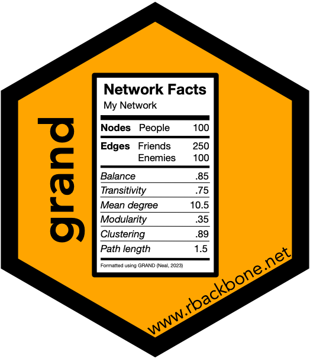

# grand 

## Welcome
Welcome to the `grand` package\! The grand package implements methods to use the Guidelines for Reporting About Network Data (GRAND) to summarize network data.

The `grand` package can be cited as:

**Neal, Z. P. (2023). grand: An R package for using the Guidelines for Reporting About Network Data. *GitHub*. [https://github.com/zpneal/grand/](https://github.com/zpneal/grand/)**

## Installation
~~The /release branch contains the current CRAN release of the grand package. You can install it from [CRAN](https://CRAN.R-project.org) with:~~
``` r
install.packages("grand")  #NOT AVAILABLE VIA CRAN YET
```

The /devel branch contains the working beta version of the next release of the grand package. All the functions are documented and have undergone various levels of preliminary debugging, so they should mostly work, but there are no guarantees. Feel free to use the devel version (with caution), and let us know if you run into any problems. You can install it You can install from GitHub with:
``` r
library(devtools)
install_github("zpneal/grand", ref = "devel", build_vignettes = TRUE)
```

## Dependencies
The `grand` package adopts the [tinyverse](https://www.tinyverse.org/) philosophy, and therefore aims to keep dependencies at a minimum.
