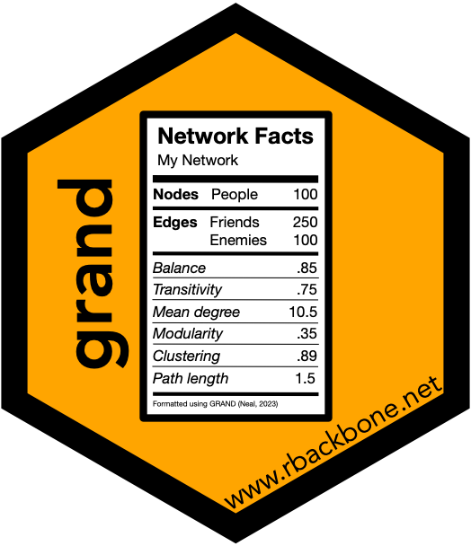

```{r, include = FALSE}
knitr::opts_chunk$set(collapse = TRUE, comment = "#>")
knitr::opts_knit$set(global.par = TRUE)
```

```{r, echo = FALSE}
set.seed(5)
par(mar = c(0, 0, 0, 0) + 0.1)
```

# Table of Contents {#toc}

[](https://www.zacharyneal.com/backbone)

1. [Introduction](#introduction)
    a. [Welcome](#welcome)
    b. [What is GRAND?](#grand)
    b. [Loading the package](#loading)
    c. [Package overview](#overview)
2. [Adding GRAND attributes](#attributes)
3. [Generating a GRAND narrative](#narrative)
4. [Generating a GRAND table](#table)
5. [More examples](#examples)
    a. [Bipartite](#bipartite)
    b. [Signed](#signed)

# Introduction {#introduction}

## Welcome {#welcome}
Thank you for your interest in the `grand` package! This vignette illustrates how to use this package to describe a network following the **G**uidelines for **R**eporting **A**bout **N**etwork **D**ata (GRAND).

The `grand` package can be cited as:

**Neal, Z. P. (2023). grand: An R package for using the Guidelines for Reporting About Network Data. GitHub. *GitHub*. [https://github.com/zpneal/grand/](https://github.com/zpneal/grand/)**

If you have questions about the grand package or would like a grand hex sticker, please contact the maintainer Zachary Neal by email ([zpneal\@msu.edu](mailto:zpneal@msu.edu)) or via Mastodon ([\@zpneal@mastodon.social](https://mastodon.social/@zpneal)). Please report bugs in the backbone package at [https://github.com/zpneal/grand/issues](https://github.com/zpneal/grand/issues).

## What is GRAND? {#grand}
XXX

## Loading the package {#loading}
The backbone package can be loaded in the usual way:
```{r setup}
library(grand)
```
Upon successful loading, a startup message will display that shows the version number, citation, ways to get help, and ways to contact us.

## Package overview {#overview}
XXX

[back to Table of Contents](#toc)

# Adding GRAND attributes {#attributes}
XXX

[back to Table of Contents](#toc)

# Generating a GRAND narrative {#narrative}
XXX

[back to Table of Contents](#toc)

# Generating a GRAND table {#table}
XXX

[back to Table of Contents](#toc)

# More examples {#examples}
## A bipartite network {#bipartite}
XXX

## A signed network {#signed}
XXX

[back to Table of Contents](#toc)

# References
